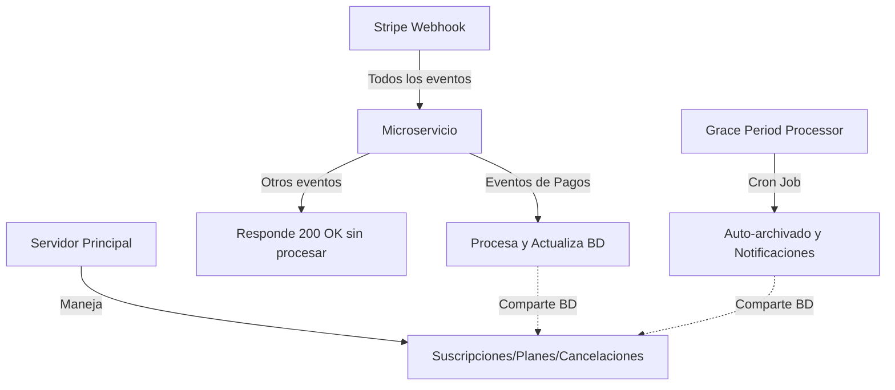

# 🏗️ Arquitectura del Microservicio de Webhooks

## 📋 Resumen

Este microservicio está **especializado en el manejo de pagos fallidos, recuperación y gestión de períodos de gracia con auto-archivado**. Complementa al servidor principal que maneja la lógica general de suscripciones.

## 🎯 Responsabilidades

### ✅ Este Microservicio MANEJA:
1. **Pagos Fallidos** (`invoice.payment_failed`)
   - Contador de intentos fallidos
   - Notificaciones escalonadas (1°, 2°, 3° y 4° intento)
   - Cambio de estado a `at_risk`, `suspended`, `grace_period`
   - Solo actualiza `accountStatus`, NO `status` ni `plan`

2. **Recuperación de Pagos** (`invoice.payment_succeeded`)
   - SOLO cuando hay fallos previos (`paymentFailures.count > 0`)
   - Resetea contadores y restaura acceso
   - Envía email de confirmación de recuperación

3. **Gestión de Períodos de Gracia y Auto-archivado** (NUEVO):
   - Procesa períodos de gracia vencidos por downgrade
   - Procesa períodos de gracia por pagos fallidos (15 días)
   - Auto-archiva contenido que excede límites del plan
   - Envía recordatorios antes del vencimiento (3 días y 1 día)
   - Limpia registros obsoletos de más de 30 días

4. **Campos que Gestiona**:
   ```javascript
   {
     // Gestión de pagos
     accountStatus: 'active' | 'at_risk' | 'suspended' | 'grace_period' | 'archived',
     paymentFailures: {
       count, firstFailedAt, lastFailedAt, 
       lastFailureReason, lastFailureCode,
       notificationsSent: { firstWarning, secondWarning, ... }
     },
     paymentRecovery: {
       inRecovery, recoveredAt
     },
     statusHistory: [], // Solo agrega entradas de tipo 'payment_*'
     
     // Gestión de archivado (cuando procesa grace periods)
     plan: 'free', // SOLO al expirar grace period por pagos
     status: 'canceled' // SOLO al expirar grace period por pagos
   }
   ```

### ❌ Este Microservicio NO MANEJA:
1. **Creación/Actualización de Suscripciones**
   - `customer.subscription.created`
   - `customer.subscription.updated`
   - `customer.subscription.deleted`

2. **Cambios de Plan Normales**
   - Upgrades/Downgrades iniciados por usuario
   - Cambios de precio
   - Actualizaciones de características

3. **Campos que NO Modifica (excepto en grace period expirado)**:
   - `status` (solo lo cambia a 'canceled' cuando expira grace period)
   - `plan` (solo lo cambia a 'free' cuando expira grace period)
   - `stripeSubscriptionId` - Solo lo lee
   - `stripePriceId` - Solo lo lee

## 🔄 Flujo de Integración



## 🚨 Reglas Importantes

1. **Procesamiento de Webhooks - No Interferir con Períodos de Gracia**:
   ```javascript
   if (subscription.downgradeGracePeriod?.expiresAt > new Date()) {
     // NO procesar pagos fallidos durante período de gracia
     return;
   }
   ```

2. **Procesamiento de Webhooks - No Procesar Suscripciones Canceladas**:
   ```javascript
   if (subscription.status === 'canceled') {
     // Ignorar eventos de pago
     return;
   }
   ```

3. **Webhooks - Solo Actualizar accountStatus**:
   - ✅ `subscription.accountStatus = 'at_risk'`
   - ❌ `subscription.status = 'active'` (NO hacer esto en webhooks)
   - ❌ `subscription.plan = 'free'` (NO hacer esto en webhooks)

4. **Grace Period Processor - PUEDE modificar plan y status**:
   ```javascript
   // SOLO cuando expira grace period por pagos
   if (gracePeriodExpired && paymentFailures.count >= 4) {
     subscription.plan = 'free';
     subscription.status = 'canceled';
     subscription.accountStatus = 'archived';
   }
   ```

5. **Historial Específico**:
   ```javascript
   statusHistory.push({
     status: 'payment_failed_1', // Usar prefijo 'payment_'
     triggeredBy: 'payment_webhook' // Para webhooks
     // o
     triggeredBy: 'grace_period_processor' // Para processor
   });
   ```

## 📊 Estados del Sistema

### Estados de Account (gestionados por este servicio):
- `active`: Pagos al día
- `at_risk`: 1-2 fallos de pago
- `suspended`: 3 fallos, características premium deshabilitadas
- `grace_period`: 4+ fallos, 15 días para resolver

### Estados de Subscription (NO modificar):
- `active`: Suscripción activa
- `canceled`: Suscripción cancelada
- `incomplete`: Pago inicial pendiente
- etc.

## 🔧 Configuración

### Variables de Entorno:
```env
# Webhooks
STRIPE_WEBHOOK_SECRET_DEV=whsec_...
WEBHOOK_URL=http://localhost:5001/api/webhook

# Base de datos (compartida con servidor principal)
MONGODB_URI=mongodb://...

# Emails
ADMIN_EMAIL=admin@example.com
SUPPORT_EMAIL=support@example.com

# AWS (para notificaciones)
AWS_REGION=sa-east-1
EMAIL_MARKETING_DEFAULT_SENDER=noreply@tuapp.com
```

### Eventos de Stripe Configurados:
Solo estos eventos deben estar activos en el webhook de Stripe:
- `invoice.payment_failed`
- `invoice.payment_succeeded`
- `invoice.paid`
- `charge.failed` (opcional)

### Tareas Programadas (Cron Jobs):
- **Grace Period Processor**: Diariamente a las 2:00 AM
  - Procesa períodos de gracia vencidos
  - Realiza auto-archivado
  - Envía recordatorios
  - Limpia datos obsoletos

## 📝 Logs y Monitoreo

### Prefijos de Log:
- `[PAYMENT_FAILED]` - Fallo de pago procesado
- `[PAYMENT_RECOVERY]` - Pago recuperado
- `[SKIP]` - Evento ignorado (no es de pagos o hay conflicto)
- `[ERROR]` - Error en procesamiento
- `[AUTO-ARCHIVE]` - Auto-archivado ejecutado
- `[PAYMENT-GRACE]` - Período de gracia por pagos procesado
- `🔄 PROCESADOR DE PERÍODOS DE GRACIA` - Ejecución del processor

### Métricas Clave:
1. Tasa de fallos por período
2. Tiempo promedio de recuperación
3. Efectividad de cada tipo de email
4. Suscripciones en cada estado
5. Elementos archivados por período
6. Recordatorios enviados

## 🚀 Despliegue

1. Este microservicio debe ejecutarse **independientemente** del servidor principal
2. Ambos servicios comparten la misma base de datos MongoDB
3. Usar PM2 para gestión de procesos:
   ```bash
   # Iniciar el microservicio completo
   pm2 start ecosystem.config.js
   
   # O iniciar componentes individuales
   pm2 start ecosystem.config.js --only stripe-webhooks
   pm2 start ecosystem.config.js --only grace-period-processor
   ```
4. El Grace Period Processor se ejecuta como cron job (2:00 AM diariamente)

## 🧪 Pruebas

Ver `/scripts/pruebas/` para herramientas de testing:
- `testWebhookEvents.js` - Simula eventos individuales
- `testPaymentFailures.js` - Simula secuencias de fallos
- Todos los scripts usan `ADMIN_EMAIL` para notificaciones

Probar Grace Period Processor:
```bash
# Ejecutar manualmente
node scripts/gracePeriodProcessor.js

# Ejecutar via scheduleTasks
node scripts/scheduleTasks.js processGracePeriods

# Script de prueba completo
./scripts/test-grace-periods.sh
```

---

**Última actualización**: Febrero 2025
**Versión**: 1.1.0 - Agregado Grace Period Processor con auto-archivado