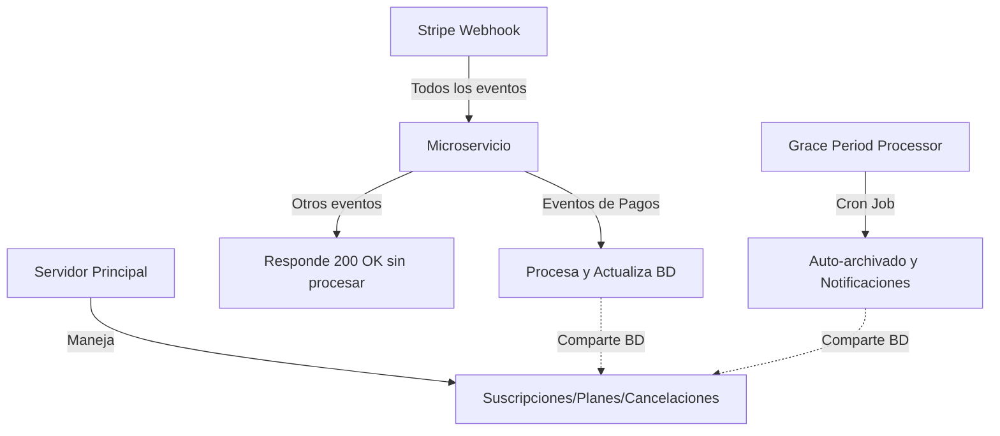

# 📚 Documentación Completa - Microservicio de Webhooks y Pagos

## 📋 Índice

1. [Descripción General](#descripción-general)
2. [Arquitectura del Sistema](#arquitectura-del-sistema)
3. [Responsabilidades del Microservicio](#responsabilidades-del-microservicio)
4. [Procesador de Períodos de Gracia](#procesador-de-períodos-de-gracia)
5. [Configuración](#configuración)
6. [Instalación y Despliegue](#instalación-y-despliegue)
7. [Pruebas](#pruebas)
8. [Monitoreo y Logs](#monitoreo-y-logs)
9. [Troubleshooting](#troubleshooting)
10. [Referencias](#referencias)

---

## 📋 Descripción General

Este es un microservicio especializado en el manejo de eventos de pago de Stripe y gestión de períodos de gracia. Sus responsabilidades principales son:

- **Procesar webhooks de pagos**: Maneja fallos de pago, recuperaciones y notificaciones
- **Gestionar períodos de gracia**: Auto-archivado de contenido cuando expiran los períodos
- **Mantener el estado de cuenta**: Actualiza `accountStatus` según el estado de los pagos

El microservicio complementa al servidor principal, compartiendo la misma base de datos MongoDB pero con responsabilidades claramente separadas.

---

## 🏗️ Arquitectura del Sistema

### Componentes Principales

```
Microservicio de Webhooks
├── Server (server.js)
│   └── Webhook Controller (webhookController.js)
│       ├── Procesa eventos de pago
│       ├── Actualiza accountStatus
│       └── Envía notificaciones
│
├── Grace Period Processor (gracePeriodProcessor.js)
│   ├── processExpiredGracePeriods() - Downgrades
│   ├── processPaymentGracePeriods() - Pagos fallidos
│   ├── performAutoArchiving() - Archivado de contenido
│   └── sendGracePeriodReminders() - Notificaciones
│
└── Scheduled Tasks (scheduleTasks.js)
    ├── Grace Period Processor (2:00 AM)
    ├── Retry Failed Webhooks (cada hora)
    └── Payment Recovery Check (cada 4 horas)
```

### Flujo de Integración



---

## 🎯 Responsabilidades del Microservicio

### ✅ Este Microservicio MANEJA:

#### 1. **Pagos Fallidos** (`invoice.payment_failed`)
- Contador de intentos fallidos
- Notificaciones escalonadas (1°, 2°, 3° y 4° intento)
- Cambio de estado a `at_risk`, `suspended`, `grace_period`
- Solo actualiza `accountStatus`, NO `status` ni `plan`

#### 2. **Recuperación de Pagos** (`invoice.payment_succeeded`)
- SOLO cuando hay fallos previos (`paymentFailures.count > 0`)
- Resetea contadores y restaura acceso
- Envía email de confirmación de recuperación

#### 3. **Gestión de Períodos de Gracia y Auto-archivado**
- Procesa períodos de gracia vencidos por downgrade
- Procesa períodos de gracia por pagos fallidos (15 días)
- Auto-archiva contenido que excede límites del plan
- Envía recordatorios antes del vencimiento (3 días y 1 día)
- Limpia registros obsoletos de más de 30 días

#### 4. **Campos que Gestiona**:
```javascript
{
  // Gestión de pagos
  accountStatus: 'active' | 'at_risk' | 'suspended' | 'grace_period' | 'archived',
  paymentFailures: {
    count, firstFailedAt, lastFailedAt, 
    lastFailureReason, lastFailureCode,
    notificationsSent: { firstWarning, secondWarning, ... }
  },
  paymentRecovery: {
    inRecovery, recoveredAt
  },
  statusHistory: [], // Solo agrega entradas de tipo 'payment_*'
  
  // Gestión de archivado (cuando procesa grace periods)
  plan: 'free', // SOLO al expirar grace period por pagos
  status: 'canceled' // SOLO al expirar grace period por pagos
}
```

### ❌ Este Microservicio NO MANEJA:

1. **Creación/Actualización de Suscripciones**
   - `customer.subscription.created`
   - `customer.subscription.updated`
   - `customer.subscription.deleted`

2. **Cambios de Plan Normales**
   - Upgrades/Downgrades iniciados por usuario
   - Cambios de precio
   - Actualizaciones de características

3. **Campos que NO Modifica (excepto en grace period expirado)**
   - `status` (solo lo cambia a 'canceled' cuando expira grace period)
   - `plan` (solo lo cambia a 'free' cuando expira grace period)
   - `stripeSubscriptionId` - Solo lo lee
   - `stripePriceId` - Solo lo lee

---

## 🔄 Procesador de Períodos de Gracia

### Funcionalidades

#### 1. Auto-archivado por Downgrade
Cuando un usuario baja de plan (ej: Premium → Standard o Free):

```javascript
// Límites por plan
const limits = {
  free: { maxFolders: 5, maxCalculators: 3, maxContacts: 10 },
  standard: { maxFolders: 50, maxCalculators: 20, maxContacts: 100 },
  premium: { maxFolders: 999999, maxCalculators: 999999, maxContacts: 999999 }
};

// Se archivan automáticamente los elementos más antiguos que excedan el límite
```

#### 2. Auto-archivado por Pagos Fallidos
Después de 15 días en `grace_period` por pagos fallidos:
- La suscripción cambia a plan FREE
- Se archiva todo el contenido que exceda los límites FREE
- Se actualiza el estado a `archived`

#### 3. Recordatorios Automatizados
- **3 días antes**: Primer recordatorio
- **1 día antes**: Recordatorio urgente
- **Recordatorio de pago**: Durante el período de gracia por pagos

#### 4. Limpieza de Datos
- Elimina registros de períodos de gracia procesados hace más de 30 días
- Limpia notificaciones antiguas

### Ejecución Manual

```bash
# Opción 1: Ejecutar directamente
node scripts/gracePeriodProcessor.js

# Opción 2: A través de scheduleTasks
node scripts/scheduleTasks.js processGracePeriods

# Script de prueba completo
./scripts/test-grace-periods.sh
```

---

## 🔧 Configuración

### Variables de Entorno

```env
# Base de datos (compartida con servidor principal)
MONGODB_URI=mongodb://...
URLDB=mongodb://...

# Webhooks
STRIPE_WEBHOOK_SECRET_DEV=whsec_...
WEBHOOK_URL=http://localhost:5001/api/webhook

# Stripe
STRIPE_API_KEY_DEV=sk_test_...

# Emails
ADMIN_EMAIL=admin@example.com
SUPPORT_EMAIL=support@example.com

# AWS (para notificaciones)
AWS_REGION=sa-east-1
EMAIL_MARKETING_DEFAULT_SENDER=noreply@tuapp.com

# URLs
BASE_URL=http://localhost:3000
BASE_URL=https://www.lawanalytics.app
```

### Eventos de Stripe Configurados

Solo estos eventos deben estar activos en el webhook de Stripe:
- `invoice.payment_failed`
- `invoice.payment_succeeded`
- `invoice.paid`
- `charge.failed` (opcional)

### Tareas Programadas (Cron Jobs)

- **Grace Period Processor**: Diariamente a las 2:00 AM
- **Retry Failed Webhooks**: Cada hora
- **Payment Recovery Check**: Cada 4 horas
- **Sync with Stripe**: Cada 6 horas

---

## 🚀 Instalación y Despliegue

### Instalación

```bash
# Clonar repositorio
git clone [repository-url]
cd la-subscriptions

# Instalar dependencias
npm install

# Configurar variables de entorno
cp .env.example .env
# Editar .env con tus valores
```

### Desarrollo

```bash
# Ejecutar en modo desarrollo
npm run dev

# O usar PM2
pm2 start ecosystem.config.js --env development
```

### Producción

```bash
# Iniciar el microservicio completo
pm2 start ecosystem.config.js --env production

# O iniciar componentes individuales
pm2 start ecosystem.config.js --only stripe-webhooks
pm2 start ecosystem.config.js --only grace-period-processor

# Guardar configuración PM2
pm2 save
pm2 startup
```

---

## 🧪 Pruebas

### Scripts de Prueba

Los scripts de prueba están en `scripts/pruebas/`:

#### 1. Simulador de Eventos Webhook
```bash
# Modo interactivo
node scripts/pruebas/testWebhookEvents.js

# Crear suscripción de prueba
node scripts/pruebas/testWebhookEvents.js create

# Enviar secuencia de pagos fallidos
node scripts/pruebas/testWebhookEvents.js seq

# Enviar evento específico
node scripts/pruebas/testWebhookEvents.js 5  # Pago fallido
```

#### 2. Pruebas de Pagos Fallidos
```bash
# Modo interactivo
node scripts/pruebas/testPaymentFailures.js

# Simular secuencia completa
node scripts/pruebas/testPaymentFailures.js seq

# Simular evento específico
node scripts/pruebas/testPaymentFailures.js 1  # Primer intento fallido
```

#### 3. Listener de Webhooks (Stripe CLI)
```bash
# Escuchar webhooks reales de Stripe
node scripts/pruebas/stripeWebhookListen.js
```

#### 4. Servidor Local de Webhooks
```bash
# Alternativa cuando hay problemas con Stripe CLI
node scripts/pruebas/stripeWebhookListenLocal.js

# En otra terminal, usar ngrok:
ngrok http 3001
```

### Flujo de Pruebas Recomendado

1. **Configurar entorno**:
   ```bash
   npm run dev  # Terminal 1
   ```

2. **Crear datos de prueba**:
   ```bash
   node scripts/pruebas/testWebhookEvents.js create  # Terminal 2
   ```

3. **Probar eventos individuales**:
   ```bash
   node scripts/pruebas/testWebhookEvents.js  # Terminal 2
   # Seleccionar eventos del menú
   ```

4. **Probar secuencia de pagos fallidos**:
   ```bash
   node scripts/pruebas/testPaymentFailures.js seq  # Terminal 2
   ```

5. **Monitorear logs**:
   ```bash
   pm2 logs stripe-webhooks  # Terminal 3
   ```

---

## 📊 Monitoreo y Logs

### Prefijos de Log

- `[PAYMENT_FAILED]` - Fallo de pago procesado
- `[PAYMENT_RECOVERY]` - Pago recuperado
- `[SKIP]` - Evento ignorado (no es de pagos o hay conflicto)
- `[ERROR]` - Error en procesamiento
- `[AUTO-ARCHIVE]` - Auto-archivado ejecutado
- `[PAYMENT-GRACE]` - Período de gracia por pagos procesado
- `🔄 PROCESADOR DE PERÍODOS DE GRACIA` - Ejecución del processor

### Comandos de Monitoreo

```bash
# Ver logs en tiempo real
pm2 logs stripe-webhooks
pm2 logs grace-period-processor

# Ver logs del procesador
pm2 logs stripe-webhooks | grep "PROCESADOR DE PERÍODOS"

# Ver archivados
grep "AUTO-ARCHIVE" logs/combined.log

# Ver recordatorios enviados
grep "gracePeriod.*Sent" logs/combined.log

# Ver errores
grep "ERROR.*grace" logs/error.log

# Monitorear webhooks
node scripts/monitorWebhooks.js
```

### Ejemplo de Log del Procesador

```
========================================
🔄 PROCESADOR DE PERÍODOS DE GRACIA
Fecha/Hora: 2024-01-15T02:00:00.000Z
========================================

📋 PASO 1: Procesando períodos de gracia vencidos...
Encontradas 3 suscripciones con período vencido
[AUTO-ARCHIVE] Procesando usuario user@example.com
[AUTO-ARCHIVE] Completado - 25 elementos archivados

📋 PASO 2: Procesando períodos de gracia por pagos fallidos...
Encontradas 2 suscripciones con período de gracia de pago vencido

📋 PASO 3: Enviando recordatorios...
Encontradas 5 suscripciones para recordatorio

📋 PASO 4: Limpiando datos obsoletos...
Se limpiaron 10 registros obsoletos

========================================
✅ PROCESAMIENTO COMPLETADO
⏱️  Duración: 12.34 segundos
📊 Resumen:
   - Períodos vencidos procesados: 3
   - Períodos de pago procesados: 2
   - Recordatorios enviados: 5
   - Registros obsoletos limpiados: 10
========================================
```

### Métricas Clave

1. Tasa de fallos por período
2. Tiempo promedio de recuperación
3. Efectividad de cada tipo de email
4. Suscripciones en cada estado
5. Elementos archivados por período
6. Recordatorios enviados

---

## 🔧 Troubleshooting

### Errores Comunes

#### Error: "Cannot find module '../models/...'"
Los scripts ahora están en una subcarpeta. Asegúrate de ejecutarlos desde la raíz del proyecto:
```bash
cd /home/mcerra/www/la-subscriptions
node scripts/pruebas/testWebhookEvents.js
```

#### Error: "No such subscription"
Primero crea la suscripción de prueba:
```bash
node scripts/pruebas/testWebhookEvents.js create
```

#### Error con Stripe CLI
Usa el servidor local alternativo:
```bash
node scripts/pruebas/stripeWebhookListenLocal.js
```

#### Error: "ADMIN_EMAIL no configurado"
Asegúrate de tener configurada la variable:
```bash
export ADMIN_EMAIL=tu-email@example.com
# O agrégala al archivo .env
```

### Debugging en MongoDB

```javascript
// Verificar suscripciones con período de gracia
db.subscriptions.find({
  'downgradeGracePeriod.expiresAt': { $exists: true },
  'downgradeGracePeriod.autoArchiveScheduled': true
})

// Suscripciones en grace_period por pagos
db.subscriptions.find({
  accountStatus: 'grace_period',
  'paymentFailures.count': { $gte: 4 }
})

// Ver eventos de webhook procesados
db.webhookevents.find().sort({ createdAt: -1 }).limit(10)
```

---

## 🚨 Reglas Importantes

### 1. Procesamiento de Webhooks

```javascript
// No interferir con períodos de gracia
if (subscription.downgradeGracePeriod?.expiresAt > new Date()) {
  return; // NO procesar pagos fallidos durante período de gracia
}

// No procesar suscripciones canceladas
if (subscription.status === 'canceled') {
  return; // Ignorar eventos de pago
}
```

### 2. Actualización de Campos

**Webhooks - Solo actualizar accountStatus**:
- ✅ `subscription.accountStatus = 'at_risk'`
- ❌ `subscription.status = 'active'` (NO hacer esto en webhooks)
- ❌ `subscription.plan = 'free'` (NO hacer esto en webhooks)

**Grace Period Processor - PUEDE modificar plan y status**:
```javascript
// SOLO cuando expira grace period por pagos
if (gracePeriodExpired && paymentFailures.count >= 4) {
  subscription.plan = 'free';
  subscription.status = 'canceled';
  subscription.accountStatus = 'archived';
}
```

### 3. Historial Específico

```javascript
statusHistory.push({
  status: 'payment_failed_1', // Usar prefijo 'payment_'
  triggeredBy: 'payment_webhook' // Para webhooks
  // o
  triggeredBy: 'grace_period_processor' // Para processor
});
```

---

## 📚 Referencias

### Archivos Principales

- **Server**: `server.js`
- **Webhook Controller**: `controllers/webhookController.js`
- **Grace Period Processor**: `scripts/gracePeriodProcessor.js`
- **Scheduled Tasks**: `scripts/scheduleTasks.js`
- **Email Service**: `services/emailService.js`
- **Subscription Service**: `services/subscriptionService.js`

### Modelos

- `models/Subscription.js`
- `models/User.js`
- `models/WebhookEvent.js`
- `models/Alert.js`

### Scripts de Utilidad

- `scripts/monitorWebhooks.js` - Monitoreo en tiempo real
- `scripts/retryFailedWebhooks.js` - Reintentar webhooks fallidos
- `scripts/checkPaymentRecovery.js` - Verificar recuperación de pagos
- `scripts/test-grace-periods.sh` - Test del procesador de grace periods

### Documentación de Pruebas

En `scripts/pruebas/docs/`:
- `PRUEBAS_WEBHOOKS_GUIA.md` - Guía completa de pruebas
- `PRUEBAS_FASE1_IDEMPOTENCIA.md` - Pruebas de idempotencia
- `FASE2_PAGOS_FALLIDOS_IMPLEMENTACION.md` - Sistema de pagos fallidos

---

## 📈 Estados del Sistema

### Estados de Account (gestionados por este servicio)
- `active`: Pagos al día
- `at_risk`: 1-2 fallos de pago
- `suspended`: 3 fallos, características premium deshabilitadas
- `grace_period`: 4+ fallos, 15 días para resolver
- `archived`: Grace period expirado, contenido archivado

### Estados de Subscription (NO modificar)
- `active`: Suscripción activa
- `canceled`: Suscripción cancelada
- `incomplete`: Pago inicial pendiente
- etc.

---

## ⚠️ Consideraciones Importantes

1. **Base de Datos Compartida**: El microservicio comparte la misma base de datos que el servidor principal
2. **No Interferencia**: Solo modifica campos específicos sin interferir con la lógica principal
3. **Idempotencia**: Todos los procesos son idempotentes - se pueden ejecutar múltiples veces sin efectos adversos
4. **Notificaciones**: Todos los emails se envían al usuario afectado y se registran en el sistema
5. **Migración**: Al migrar desde el servidor principal, desactivar el procesamiento de grace periods allí

---

## 🔄 Migración desde Servidor Principal

Para desactivar el procesamiento en el servidor principal:

1. Comentar o eliminar el cron job de `checkGracePeriods` en el servidor principal
2. Verificar que el microservicio esté ejecutando el nuevo procesador:
   ```bash
   pm2 start ecosystem.config.js --only grace-period-processor
   pm2 save
   ```
3. Monitorear durante 24-48 horas para asegurar funcionamiento correcto:
   ```bash
   pm2 logs grace-period-processor --lines 100
   ```

---

**Última actualización**: Febrero 2025  
**Versión**: 1.1.0 - Microservicio con Grace Period Processor integrado