# 📧 Diagrama de Flujo de Emails - Microservicio de Suscripciones

## 🎯 Resumen General

Este microservicio gestiona **14 templates únicos** de email relacionados con:
- **Suscripciones**: Creación, actualización, cancelación
- **Períodos de Gracia**: Recordatorios y expiración
- **Pagos Fallidos**: Secuencia de reintentos y recuperación

---

## 📊 Diagrama de Flujo Principal

```mermaid
graph TB
    subgraph "EVENTOS DE STRIPE (Webhooks)"
        W1[customer.subscription.created]
        W2[customer.subscription.updated]
        W3[customer.subscription.deleted]
        W4[invoice.payment_failed]
        W5[invoice.paid]
    end

    subgraph "TAREAS PROGRAMADAS (Cron)"
        C1[checkGracePeriods<br/>Diario 2:00 AM]
        C2[gracePeriodProcessor<br/>Diario 2:00 AM]
        C3[checkPaymentRecovery<br/>Cada 4 horas]
    end

    subgraph "EMAILS DE SUSCRIPCIÓN"
        E1[subscriptionCreated]
        E2[subscriptionScheduledCancellation]
        E3[subscriptionImmediateCancellation]
        E4[planDowngraded]
        E5[planUpgraded]
    end

    subgraph "EMAILS DE PERÍODO DE GRACIA"
        E6[gracePeriodReminderWithExcess]
        E7[gracePeriodReminderNoExcess]
        E8[gracePeriodExpiredWithArchive]
        E9[gracePeriodExpiredNoArchive]
    end

    subgraph "EMAILS DE PAGOS FALLIDOS"
        E10[paymentFailedFirst]
        E11[paymentFailedSecond]
        E12[paymentFailedFinal]
        E13[paymentFailedSuspension]
        E14[paymentRecovered]
    end

    W1 --> E1
    W2 --> |"Plan upgrade"| E5
    W2 --> |"Plan downgrade"| E4
    W2 --> |"cancel_at_period_end = true"| E2
    W3 --> |"immediate = true"| E3
    W3 --> |"immediate = false"| E2
    
    W4 --> |"Intento 1"| E10
    W4 --> |"Intento 2"| E11
    W4 --> |"Intento 3"| E12
    W4 --> |"Intento 4+"| E13
    
    W5 --> |"Si había fallo previo"| E14
    
    C1 --> |"3 días antes"| E6
    C1 --> |"3 días antes"| E7
    C1 --> |"1 día antes"| E6
    C1 --> |"1 día antes"| E7
    
    C2 --> |"Al expirar con archivado"| E8
    C2 --> |"Al expirar sin archivado"| E9
    
    C3 --> |"Pago recuperado"| E14
```

---

## 📨 Detalle de Cada Template de Email

### 1. SUSCRIPCIONES

#### 📬 **subscriptionCreated**
- **Trigger**: Webhook `customer.subscription.created`
- **Archivo**: `controllers/webhookController.js:handleSubscriptionCreated()`
- **Condición**: Nueva suscripción creada en Stripe
- **Variables**: userName, planName, maxFolders, maxCalculators, maxContacts, nextBillingDate

#### 📬 **subscriptionScheduledCancellation**
- **Trigger**: Webhook `customer.subscription.updated` con `cancel_at_period_end = true`
- **Archivo**: `controllers/webhookController.js:handleSubscriptionUpdated()`
- **Condición**: Usuario programa cancelación al final del período
- **Variables**: userName, previousPlan, cancelDate
- **Plazo**: Se cancela al final del período de facturación actual

#### 📬 **subscriptionImmediateCancellation**
- **Trigger**: 
  - Webhook `customer.subscription.deleted`
  - Llamada directa en `subscriptionService.js:handleImmediateCancellation()`
- **Archivo**: `services/subscriptionService.js:513`
- **Condición**: Cancelación inmediata de suscripción
- **Variables**: userName, previousPlan
- **Efecto**: Activa período de gracia de 15 días

#### 📬 **planDowngraded**
- **Trigger**: Webhook `customer.subscription.updated`
- **Archivo**: `controllers/webhookController.js:handleSubscriptionUpdated()`
- **Condición**: Usuario cambia a un plan inferior
- **Variables**: userName, previousPlan, newPlan, gracePeriodEnd, newLimits
- **Efecto**: Activa período de ajuste de 15 días

#### 📬 **planUpgraded**
- **Trigger**: Webhook `customer.subscription.updated`
- **Archivo**: `controllers/webhookController.js:handleSubscriptionUpdated()`
- **Condición**: Usuario cambia a un plan superior
- **Variables**: userName, previousPlan, newPlan, newLimits
- **Efecto**: Restauración inmediata de datos archivados

---

### 2. PERÍODOS DE GRACIA

#### 📬 **gracePeriodReminderWithExcess**
- **Trigger**: Tarea programada diaria (2:00 AM)
- **Archivo**: `scripts/checkGracePeriods.js:260`
- **Condiciones**:
  - Período de gracia activo
  - Faltan 3 días o 1 día para expirar
  - Usuario tiene recursos que exceden límites del plan gratuito
- **Variables**: userName, daysRemaining, gracePeriodEnd, currentFolders, currentCalculators, currentContacts, foldersToArchive, calculatorsToArchive, contactsToArchive
- **Frecuencia**: 2 emails (3 días antes y 1 día antes)

#### 📬 **gracePeriodReminderNoExcess**
- **Trigger**: Tarea programada diaria (2:00 AM)
- **Archivo**: `scripts/checkGracePeriods.js:260`
- **Condiciones**:
  - Período de gracia activo
  - Faltan 3 días o 1 día para expirar
  - Usuario NO excede límites del plan gratuito
- **Variables**: userName, daysRemaining, gracePeriodEnd, currentFolders, currentCalculators, currentContacts
- **Frecuencia**: 2 emails (3 días antes y 1 día antes)

#### 📬 **gracePeriodExpiredWithArchive**
- **Trigger**: Tarea programada diaria (2:00 AM)
- **Archivo**: `scripts/gracePeriodProcessor.js:128`
- **Condiciones**:
  - Período de gracia expirado
  - Se archivaron elementos automáticamente
- **Variables**: userName, targetPlan, totalArchived, foldersArchived, calculatorsArchived, contactsArchived, planLimits
- **Efecto**: Archivado automático completado

#### 📬 **gracePeriodExpiredNoArchive**
- **Trigger**: Tarea programada diaria (2:00 AM)
- **Archivo**: `scripts/gracePeriodProcessor.js:128`
- **Condiciones**:
  - Período de gracia expirado
  - NO se requirió archivar elementos
- **Variables**: userName, targetPlan, planLimits
- **Efecto**: Transición completa a plan gratuito

---

### 3. PAGOS FALLIDOS

#### 📬 **paymentFailedFirst**
- **Trigger**: Webhook `invoice.payment_failed`
- **Archivo**: `controllers/webhookController.js:handleInvoicePaymentFailed()`
- **Condición**: Primer intento de pago fallido
- **Variables**: userName, userEmail, amount, currency, planName, failureReason, nextRetryDate, updatePaymentUrl
- **Reintento**: En 3 días

#### 📬 **paymentFailedSecond**
- **Trigger**: Webhook `invoice.payment_failed`
- **Archivo**: `controllers/webhookController.js:handleInvoicePaymentFailed()`
- **Condición**: Segundo intento de pago fallido
- **Variables**: userName, userEmail, daysUntilSuspension, updatePaymentUrl
- **Advertencia**: Suspensión en 7 días

#### 📬 **paymentFailedFinal**
- **Trigger**: Webhook `invoice.payment_failed`
- **Archivo**: `controllers/webhookController.js:handleInvoicePaymentFailed()`
- **Condición**: Tercer intento de pago fallido
- **Variables**: userName, userEmail, updatePaymentUrl
- **Efecto**: Suspensión al día siguiente

#### 📬 **paymentFailedSuspension**
- **Trigger**: Webhook `invoice.payment_failed`
- **Archivo**: `controllers/webhookController.js:handleInvoicePaymentFailed()`
- **Condición**: Cuarto+ intento de pago fallido
- **Variables**: userName, userEmail, suspensionDate, gracePeriodEnd, updatePaymentUrl
- **Efecto**: Activa período de gracia de 15 días

#### 📬 **paymentRecovered**
- **Trigger**: 
  - Webhook `invoice.paid` (si había fallo previo)
  - Tarea programada cada 4 horas
- **Archivos**: 
  - `controllers/webhookController.js:handleInvoicePaid()`
  - `scripts/checkPaymentRecovery.js`
- **Condición**: Pago exitoso después de fallos previos
- **Variables**: userName, userEmail, amount, currency, planName, nextBillingDate
- **Efecto**: Restaura acceso completo

---

## 🕐 Plazos y Temporización

### Períodos de Gracia
- **Duración**: 15 días
- **Recordatorios**: 3 días antes y 1 día antes de expirar
- **Activación**:
  - Cancelación inmediata
  - Downgrade de plan
  - Suspensión por pagos fallidos (4+ intentos)

### Secuencia de Pagos Fallidos
1. **Intento 1**: Notificación suave, reintento en 3 días
2. **Intento 2**: Advertencia, suspensión en 7 días
3. **Intento 3**: Último aviso, suspensión mañana
4. **Intento 4+**: Suspensión + período de gracia 15 días

### Tareas Programadas
- **checkGracePeriods**: Diario a las 2:00 AM
- **gracePeriodProcessor**: Diario a las 2:00 AM
- **checkPaymentRecovery**: Cada 4 horas
- **sendGracePeriodReminders**: Diario a las 10:00 AM

---

## 🔧 Archivos Clave del Sistema

1. **Controllers**:
   - `controllers/webhookController.js` - Maneja todos los webhooks de Stripe

2. **Services**:
   - `services/emailService.js` - Servicio central de envío de emails
   - `services/subscriptionService.js` - Lógica de negocio de suscripciones

3. **Scripts Programados**:
   - `scripts/scheduleTasks.js` - Configuración de cron jobs
   - `scripts/checkGracePeriods.js` - Verifica y envía recordatorios
   - `scripts/gracePeriodProcessor.js` - Procesa períodos expirados
   - `scripts/checkPaymentRecovery.js` - Verifica pagos recuperados

4. **Modelos**:
   - `models/EmailTemplate.js` - Templates de email en BD
   - `models/Subscription.js` - Datos de suscripciones
   - `models/User.js` - Datos de usuarios

---

## 📝 Notas Importantes

1. **Sistema de Fallback**: Si un template no existe en BD, usa el código HTML hardcodeado en `emailService.js`

2. **Whitelist en Modo Test**: En modo test, solo se envían emails a direcciones en la whitelist

3. **Templates Sin Lógica**: Los nuevos templates no contienen lógica condicional, el servicio elige el template correcto según los datos

4. **Idempotencia**: El sistema usa `WebhookEvent` para evitar procesar webhooks duplicados

5. **Logs**: Todos los envíos se registran con MessageId de AWS SES para trazabilidad